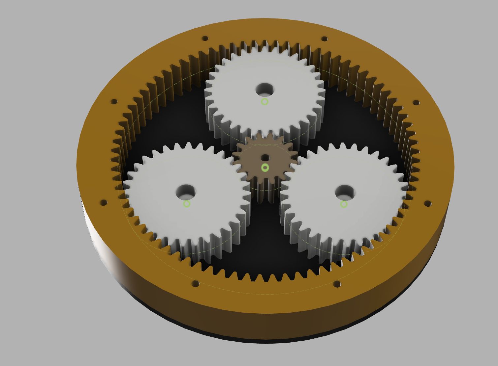

# Planetary Gear System (1:6 Ratio) NEMA 17

  
*Outer view of the assembly*

  
*Internal gear view with planets and sun gear*

---

## 📖 Overview
This repository contains the design of a **planetary gear system** (also known as an epicyclic gear train) with a **gear reduction ratio of 1:6**.  

Planetary gears are widely used in robotics, automotive transmissions, and industrial applications due to their **compactness, efficiency, and high torque density**.  

This project demonstrates a **CAD model** of a planetary gear set created for educational and prototyping purposes.

---

## ⚙️ Features
- **1:6 Gear Ratio** (input-to-output speed reduction).  
- **Planetary Gear Train** composed of:
  - **Sun Gear** (center input).  
  - **Planet Gears** (three equally spaced).  
  - **Ring Gear** (internal gear with outer housing).  
  - **Carrier Plate** (holds planets and transmits output).  
- **Compact cylindrical housing** with bolt mounts.  
- **Scalable design** for use in robotics and mechanical projects.

---

## 🛠️ Design
- **CAD Software:** FUSION 360
- **Gear type:** Spur gears with internal ring gear.  

---

## 🚀 Applications
- Robotics (arm joints, wheel drives).  
- Electric vehicles & transmissions.  
- Aerospace mechanisms.  
- DIY prototyping and mechanical demonstrations.  

---

## 🔧 Future Improvements
- Add **bearings** for smoother motion.  
- Explore different **gear ratios** by modifying tooth counts.  
- Simulate **torque and efficiency**.  
- Create a **3D-printable version** with assembly instructions.  

---

## 📜 License
This project is licensed under the **MIT License** – feel free to use, modify, and distribute with attribution.  
